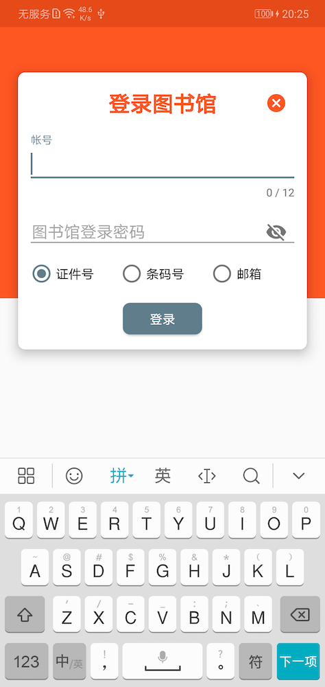
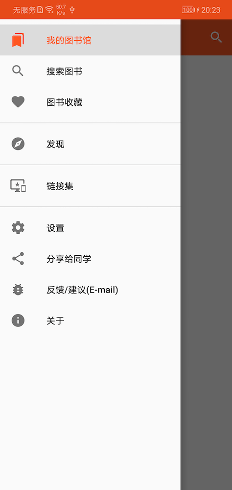
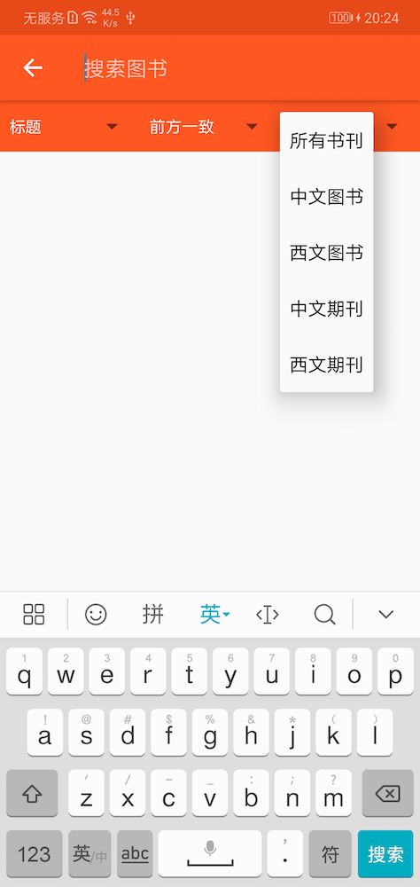
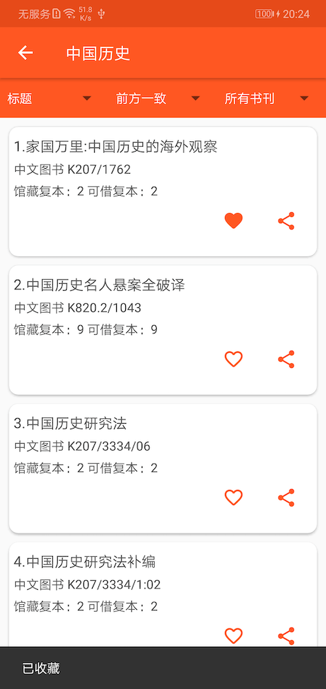
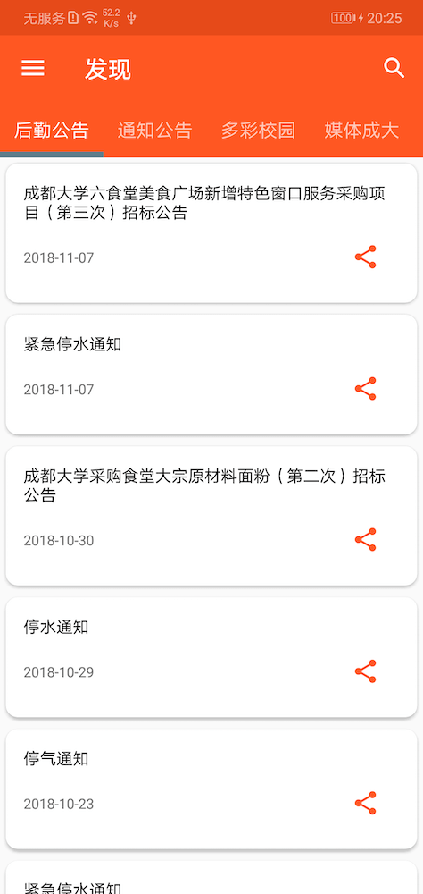

# 成大图书馆

### 一个简约的材料设计风格图书馆安卓应用 

<a href="https://fir.im/cdukits" style="font-size:24px; border: solid; background: #b0c4de; display: block; text-align: center; margin: 20px; text-decoration: none; color: white;"> 
最新版 v 4.6 已发布，下载安装
</a>

|功能|描述|
|:--------:|:-------:|
|图书馆|登录图书馆 个人图书借阅超期等信息 图书搜索收藏|
|发现|学校通知公告 后勤处通知 成大要文 综合新闻 媒体成大 多彩校园 学术文化|

---

## Screenshots

| Login | Drawer |
|:-:|:-:|
|  |  |

| Search | List |Notice|
|:-:|:-:|:-:|
|  |  | |

---

## Support By

* Jsoup
* RxJava
* Retrofit
* OkHttp
* Lite-orm

## Structure

* MVP
* Single Activity -> Fragments
